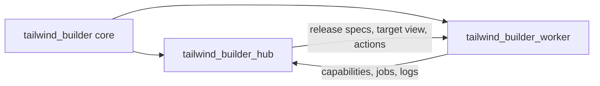

# Tailwind Builder Hub

## Goal

Define the evolution of `tailwind_builder` into a reactive remote build and artifact publishing system without blocking the immediate value: shipping `tailwindcss 4.2.2` + `@tailwindcss/cli 4.2.2` + `daisyui 5.5.19` to `storage.defdo.de`.

The core direction is to separate three layers:

1. `tailwind_builder`
   Shared core for download, plugins, build, and deploy.
2. `tailwind_builder_hub`
   Server application that discovers workers, schedules jobs, publishes artifacts, and exposes UI/API.
3. `tailwind_builder_worker`
   Installable agent that runs on each host to execute jobs and report status.

## Current Repository State

This repository already contains reusable building blocks, but it is not the hub yet:

- `Defdo.TailwindBuilder.Core`
  Exposes technical constraints and compatibility.
- `Defdo.TailwindBuilder.Downloader`
  Downloads and extracts sources.
- `Defdo.TailwindBuilder.PluginManager`
  Integrates plugins.
- `Defdo.TailwindBuilder.Builder`
  Compiles.
- `Defdo.TailwindBuilder.Deployer`
  Publishes binaries.
- `Defdo.TailwindBuilder.Orchestrator`
  Coordinates the local pipeline.
- `Defdo.TailwindBuilder.NodeManager`
  Already provides in-memory registration and heartbeats.
- `Defdo.TailwindBuilder.RemoteBuilder`
  Already models a client for `/api/v1/...`.
- `Defdo.TailwindBuilder.GitHubBuilder`
  Already models builds through GitHub Actions.

Current gaps:

- The hub app exists, but it still renders a snapshot instead of live worker and release data.
- There is no persistence for workers, jobs, releases, or artifacts.
- The worker app exists, but it is still a scaffold and not an installable OTP release.
- `NodeManager` assumes a push model toward the node.
- Target naming is inconsistent across UI, filenames, and toolchain identifiers.

The first app scaffold is now in place as sibling projects, which lets the repo
separate layout from core logic without pretending the full platform already
exists.

### App Layout

- `../tailwind_builder_hub`
  Phoenix dashboard shell and hub snapshot boundary.
- `../tailwind_builder_worker`
  Installable worker scaffold with capability reporting and job state.



Boundary rules:

- Core owns release orchestration and target mapping.
- Hub owns discovery, scheduling, and operator layout.
- Worker owns execution and host reporting.
- LiveView stays in the hub UI only.
- Worker transport starts as HTTP polling, not browser-driven WS.

## Naming Decision

The recommended name for the server-side application is `tailwind_builder_hub`.

Reasoning:

- "hub" better describes a center for discovery, scheduling, artifacts, and state.
- It avoids tying the name only to the controller role.
- It leaves room for UI, auth, releases, and workers to live under one app.

## Design Principles

1. The system must be reactive, not passive.
   If a binary is missing for a target, the UI should show it and offer `Compile missing` when capacity exists.
2. Targets should not block the system just because a fixed matrix is incomplete.
   They should be discovered from connected workers and compared against what is already published.
3. The product-facing target is not the same as the technical build target.
4. LiveView is for the UI.
   It should not be used as the worker protocol.
5. `Phoenix.PubSub` is for internal hub fan-out.
   It does not replace transport between the hub and workers.
6. The first delivery must optimize time-to-value:
   remote release of `4.2.2` before building the full distributed platform.

## Canonical Target Naming

The hub needs a canonical layer so it does not depend on mixed strings such as:

- `darwin-arm64`
- `macos-arm64`
- `aarch64-apple-darwin`

Three different fields should exist:

### 1. `target_key`

Canonical identifier shown in the UI, manifest, and storage.

Examples:

- `linux-x64`
- `linux-arm64`
- `macos-x64`
- `macos-arm64`
- `windows-x64`
- `windows-arm64`
- `freebsd-x64`

### 2. `build_target`

Technical toolchain identifier.

Examples:

- `x86_64-unknown-linux-gnu`
- `aarch64-unknown-linux-gnu`
- `x86_64-apple-darwin`
- `aarch64-apple-darwin`

### 3. `artifact_name`

Final published binary name.

Examples:

- `tailwindcss-linux-x64`
- `tailwindcss-linux-arm64`
- `tailwindcss-macos-x64`
- `tailwindcss-macos-arm64`

### Rule

The UI and the manifest always speak in `target_key`.
The builder and the toolchain operate on `build_target`.
The deployer publishes `artifact_name`.

This removes ambiguity across discovery, compilation, and storage.

## Reactive Target Model

The hub should not depend on "the full matrix is online." It should derive state from three views:

### 1. `discovered_targets`

Targets currently announced by workers through registration or heartbeat.

Example:

- `linux-x64`
- `linux-arm64`
- `macos-arm64`

### 2. `desired_targets`

Targets the product wants to support for a release or channel.

Example:

- `linux-x64`
- `linux-arm64`
- `macos-arm64`
- `macos-x64`

### 3. `published_targets`

Targets already published to storage with valid checksum and metadata.

Example:

- `linux-x64`
- `linux-arm64`

## Derived Target States

Each release-target pair should resolve to one of these states:

- `published`
  A valid artifact already exists in storage.
- `buildable_now`
  It is not published, but currently discovered capacity can build it now.
- `missing`
  It is desired, not published, and no capacity is available right now.
- `unavailable`
  It is not desired and not published; this is an informational state only.
- `failed`
  The latest build for that target failed.
- `stale`
  An artifact exists, but it no longer matches the current release spec, checksum, or plugin set.
- `building`
  There is an active job for that target.

## State Derivation

Practical rules:

- if a valid artifact exists -> `published`
- if an active job exists -> `building`
- if the latest job failed -> `failed`
- if an artifact exists but the current spec changed -> `stale`
- if the artifact is missing and the target is in `discovered_targets` -> `buildable_now`
- if the artifact is missing and the target is in `desired_targets` but not in `discovered_targets` -> `missing`
- otherwise -> `unavailable`

This makes the UI reactive:

- `Compile missing`
- `Retry failed`
- `Rebuild stale`
- `Promote rc`
- `Republish manifest`
- `Mark unsupported`

## Hub Entities

### `Worker`

Represents a host or execution agent.

Minimum fields:

- `id`
- `name`
- `status`
- `transport`
- `last_seen_at`
- `host_os`
- `host_arch`
- `max_concurrent_jobs`
- `metadata`

Recommended states:

- `online`
- `draining`
- `offline`
- `disabled`

### `WorkerCapability`

Describes what a worker can build.

Minimum fields:

- `worker_id`
- `target_key`
- `build_target`
- `tailwind_majors`
- `tool_versions`
- `supported_plugins`
- `priority`

### `ReleaseSpec`

Defines the desired release, not the artifact already built.

Minimum fields:

- `id`
- `channel`
- `tailwind_version`
- `tailwind_cli_version`
- `plugin_set`
- `desired_targets`
- `storage_prefix`
- `status`

For the first flow:

- `tailwind_version = 4.2.2`
- `tailwind_cli_version = 4.2.2`
- `plugin_set = [%{name: "daisyui", version: "5.5.19"}]`

### `BuildJob`

Executable unit assigned to a worker or another remote backend.

Minimum fields:

- `id`
- `release_spec_id`
- `target_key`
- `build_target`
- `executor`
- `status`
- `attempt`
- `queued_at`
- `started_at`
- `finished_at`
- `logs_url`
- `error`

Recommended states:

- `queued`
- `assigned`
- `running`
- `succeeded`
- `failed`
- `cancelled`

### `Artifact`

Represents the produced and verifiable binary.

Minimum fields:

- `id`
- `release_spec_id`
- `target_key`
- `artifact_name`
- `storage_url`
- `checksum_sha256`
- `size_bytes`
- `built_by_worker_id`
- `built_from_job_id`
- `published_at`
- `status`

Recommended states:

- `draft`
- `published`
- `superseded`
- `invalid`

## Reuse of Existing Modules

The hub should not rewrite the current library. It should build on top of it:

- `Core` and `ArchitectureMatrix`
  Base for technical constraints and the planner.
- `Downloader`, `PluginManager`, `Builder`, `Deployer`
  Execution engine inside the worker or another remote backend.
- `Orchestrator`
  Local per-job pipeline.
- `NodeManager`
  Can serve as the draft of worker registration, but it must evolve from in-memory to persistent state and from push to pull.
- `RemoteBuilder`
  Can remain as the hub client SDK.
- `GitHubBuilder`
  Can remain as an alternate scheduler backend for builds through GitHub Actions.

## Transport and Real-Time Strategy

### UI

Use Phoenix + LiveView for:

- release dashboard
- worker table
- real-time jobs
- manual actions

### Workers

Do not use LiveView to connect workers.

Recommended phase 1:

- HTTP polling
- registration
- heartbeat
- `next_job`
- progress reporting
- artifact publish

Optional phase 2:

- Phoenix Channels or plain WebSocket if lower latency or log streaming becomes necessary

### PubSub

Use `Phoenix.PubSub` only for:

- refreshing LiveView panels
- internal scheduler event fan-out
- broadcasting state changes across hub processes

It should not be the worker protocol.

## Minimal Hub API

### Releases

- `POST /api/v1/releases`
- `GET /api/v1/releases`
- `GET /api/v1/releases/:id`
- `POST /api/v1/releases/:id/compile_missing`
- `POST /api/v1/releases/:id/promote`
- `POST /api/v1/releases/:id/republish_manifest`

### Workers

- `POST /api/v1/workers/register`
- `POST /api/v1/workers/:id/heartbeat`
- `POST /api/v1/workers/:id/next_job`
- `POST /api/v1/workers/:id/jobs/:job_id/events`
- `PUT /api/v1/workers/:id/jobs/:job_id/artifact`

### Discovery

- `GET /api/v1/targets/discovered`
- `GET /api/v1/targets/published`
- `GET /api/v1/targets/matrix`

## Recommended Operating Flow

### Phase 0: Immediate Value

Do not wait for the full hub.
First, make the remote flow for publishing `4.2.2` reliable.

Pipeline:

1. define `ReleaseSpec`
2. discover available workers
3. create missing jobs by `target_key`
4. compile
5. run smoke tests
6. calculate `sha256`
7. publish artifacts
8. generate `manifest.json`
9. generate `sha256sums.txt`
10. promote `rc` to stable

### Phase 1: Hub MVP

Goal:

- manage releases
- visualize reactive targets
- trigger `Compile missing`
- inspect worker and job state

Do not block on:

- advanced distributed auth
- automatic worker installer
- Channels
- multi-tenant support

### Phase 2: Installable Worker

`tailwind_builder_worker` as an OTP release with embedded ERTS.

Expected installation:

- Ubuntu via `systemd`
- macOS via `launchd`

Flow:

1. download worker release
2. verify checksum
3. extract
4. install service
5. register against the hub
6. send heartbeats and request jobs

## Tailwind 4.2.2 Release MVP

First release handled by the hub:

- `tailwindcss 4.2.2`
- `@tailwindcss/cli 4.2.2`
- `daisyui 5.5.19`

Recommended channel:

- `v4.2.2-rc1` first

Recommended storage path:

- `https://storage.defdo.de/tailwind_cli_daisyui/v4.2.2-rc1/`

Minimum artifacts by target:

- `tailwindcss-linux-x64`
- `tailwindcss-linux-arm64`
- `tailwindcss-macos-arm64`
- `tailwindcss-macos-x64` when capacity exists

Auxiliary files:

- `manifest.json`
- `sha256sums.txt`

The manifest should include per artifact:

- `target_key`
- `artifact_name`
- `sha256`
- `size_bytes`
- `storage_url`
- `built_at`
- `plugin_set`

## Minimum Smoke Test per Artifact

Before publishing, every binary must compile at least:

```css
@import "tailwindcss";
@plugin "daisyui";
```

And validate:

- non-empty CSS output
- presence of Tailwind base utilities
- presence of DaisyUI-generated classes
- successful exit status

## Execution Backends

The hub should support more than one backend for artifact production:

### 1. `:worker`

Native worker connected to the hub.

### 2. `:github_actions`

Temporary or complementary backend when a hosted runner is preferable, for example `macos-x64`.

### 3. `:ssh`

Transition backend for the hosts that already exist while the installable worker is being built.

This lets the system move quickly now and converge later toward the native worker model without discarding the MVP.

## Auth

The future integration should align with `defdo_auth` and `defdo_auth_client`.

Recommended first integration:

- short-lived tokens for worker registration
- signed authentication for callbacks and artifact publishing
- simple rotation from the hub

The remote release MVP should not depend on finishing all of this first.

## Current Risks the Hub Must Address

1. `NodeManager` is currently transient and in-memory.
2. `RemoteBuilder` and other modules use different target formats.
3. `Application` does not yet start worker registration or a real API.
4. Jobs do not have a persistent model or recoverable state.
5. There is no single source of truth yet for `discovered_targets`, `desired_targets`, and `published_targets`.

## Proposed Roadmap

### Step 1

Normalize targets in the shared core:

- introduce `target_key`
- introduce translation to `build_target`
- introduce helper logic for `artifact_name`

### Step 2

Build the first remote release flow:

- `4.2.2`
- `4.2.2-rc1`
- smoke tests
- checksums
- manifest
- publish to storage

### Step 3

Create `tailwind_builder_hub`:

- Phoenix app
- LiveView dashboard
- simple scheduler
- persistence for releases, workers, jobs, and artifacts

### Step 4

Create `tailwind_builder_worker`:

- release with embedded ERTS
- polling against the hub
- isolated execution per job

## Final Direction

The right direction is:

- `tailwind_builder` remains the reusable core
- `tailwind_builder_hub` becomes the reactive center of the system
- `tailwind_builder_worker` comes after that

But the first deliverable is not the whole platform.
The first deliverable is a reliable remote flow for compiling and publishing `Tailwind 4.2.2`, with visible state and detectable missing targets.
